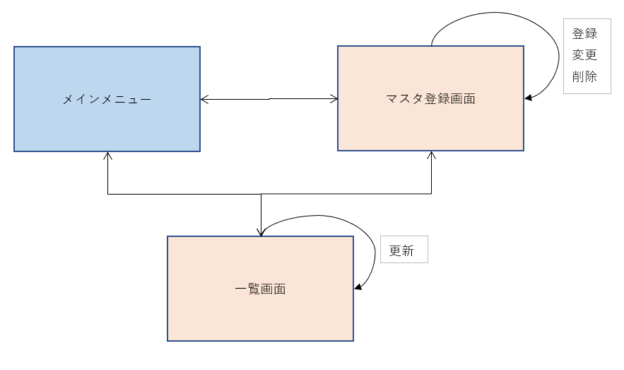
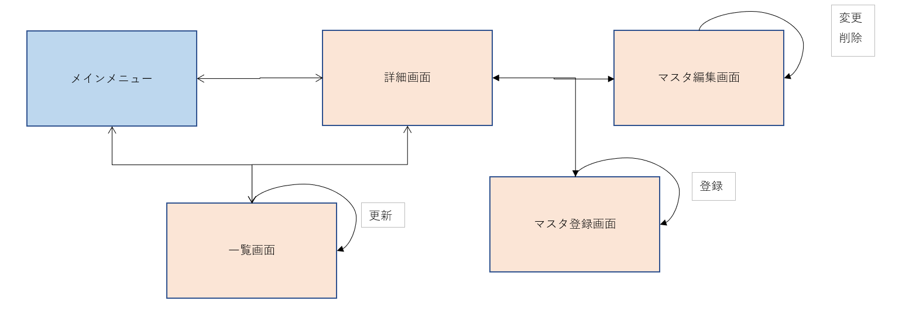

# 画面一覧 
### 目的 
　麻雀システムの画面一覧について記述する。

### 変更履歴
|更新年月日|更新内容|版数|
|--|--|--|
|2019/12/04|初版発行|0|

### 画面一覧  

※画面遷移図確定後に修正する。
 |画面名|オブジェクト名|説明|
 |--|--|--|
 |メインメニュー|MainMenu|メインメニューを表示する。|
 |一覧画面|ListDisplay|マスタ登録された役や牌、点数を一覧表示する。|
 |マスタ登録画面|MasterDisplay|牌や役、点数のマスタデータを登録する。|

 ### 画面遷移図  

1. 案1(柏木案)

2. 案2(webサイト参考)

