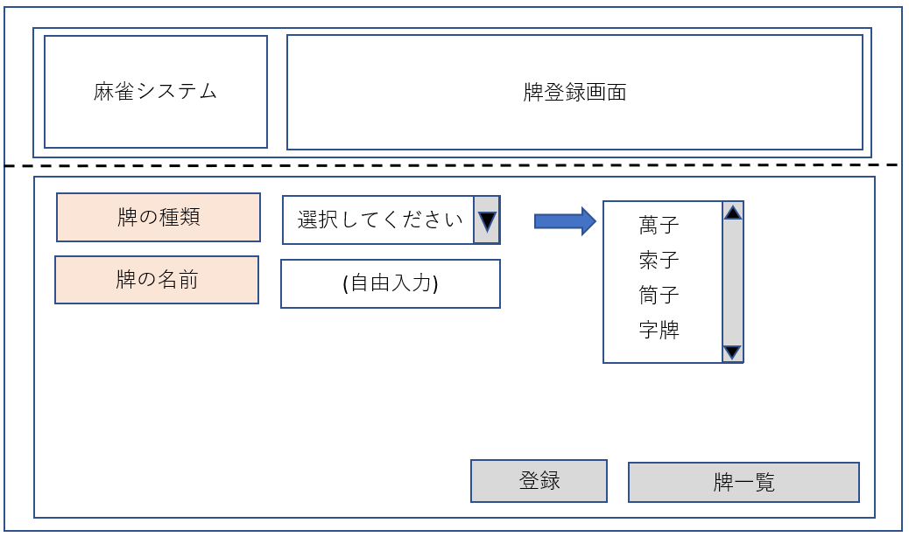

# 画面設計書
### 目的 
　麻雀システムの画面の機能について記述する。

### 変更履歴
|更新年月日|更新内容|版数|
|--|--|--|
|2019/12/04|初版発行|0|
|2019/12/25|・画面一覧を画面設計書に変更 ・画面イメージ、画面項目一覧を記述 |0.1|

### 画面一覧  

 |画面名|html名|説明|
 |--|--|--|
 |メインメニュー|MainMenu|メインメニューを表示する。|
 |牌一覧画面|PaiList|登録された牌データを一覧表示する。|
 |牌詳細画面|PaiDetail|牌データの詳細を表示する。  また、牌データを削除する。|
 |牌登録画面|PaiRegister|牌データを登録する。|
 |牌変更画面|PaiAlter|牌データを変更する。|

### 画面遷移図  

  

### 画面イメージ  

+ 全画面共通  

* メインメニュー 

* 牌一覧画面  

* 牌登録画面  

* 牌詳細画面  

* 牌変更画面  

* 牌登録画面(エラー発生時)  
※牌変更画面でエラーが発生した場合も同様のレイアウトでエラーメッセージを表示する。
.png)

### 画面項目一覧  

|画面名|項目名|項目英名|形式|I/O|必須かどうか|文字種|桁数|備考|
|--|--|--|--|--|--|--|--|--|
|全画面共通|システム名|ー|label|ー|ー|ー|10|システム名を表示する。"麻雀システム"固定。|
||画面名|ー|label|ー|ー|ー|10|現在表示している画面名を表示する。|
|メインメニュー|牌一覧|toPaiList|button|ー|ー|ー|ー|牌一覧画面を表示する。|
|牌一覧画面|牌の種類(データ欄)|paiTypesValue|text|O|必須|文字|2|牌の種類を表示する。|
||牌の名前(データ欄)|paiNamesValue|text|O|必須|文字|2|牌の名前を表示する。 詳細画面へのリンクとする。 拡張案⇒牌の図(牌のフォント)と牌コードを結びつけて牌の図を表示する。|
||登録画面へ|toPaiRegister|button|ー|ー|ー|ー|牌登録画面へ移動する。|
||詳細画面へ|toPaiDetail|button|ー|ー|ー|ー|牌詳細画面へ移動する。|
||メインメニュー|toMainMenu|button|ー|ー|ー|ー|メインメニューへ移動する。|
|牌登録画面|牌の種類|ー|label|ー|ー|ー|ー||
||牌の種類(入力欄)|paiTypesValue|select|I|必須|文字|2|牌の種類を入力する。|
||牌の名前|ー|label|ー|ー|ー|ー||
||牌の名前(入力欄)|paiNamesValue|text|I|必須|文字|2|牌の名前を入力する。 入力ルール以外を入力した場合、エラーを表示する。|
||登録|regButtun|button|ー|ー|ー|ー|入力した情報をDBへ登録する。 牌の種類が選択されていないまたは 牌の名前が空白の場合または牌コードが重複した場合はエラーを表示する。|
|牌詳細画面|牌の種類|ー|label|ー|ー|ー|ー||
||牌の種類(データ欄)|paiTypesValue|text|O|必須|文字|2|牌一覧画面で選択した牌の種類を表示する。(readonly)|
||牌の名前|ー|label|ー|ー|ー|ー||
||牌の名前(データ欄)|paiNamesValue|text|O|必須|文字|2|牌一覧画面で選択した牌の名前を表示する。(readonly)|
||削除|delButton|button|ー|ー|ー|ー|牌データをDBより削除する。|
||変更|toPaiAlter|button|ー|ー|ー|ー|牌変更画面へ移動する。|
|牌変更画面|牌の種類|ー|label|ー|ー|ー|ー||
||牌の種類(データ欄)|paiTypesValue|select|I/O|必須|文字|2|牌の種類を入力する。 牌詳細画面のデータを初期表示する。|
||牌の名前|ー|label|ー|ー|ー|ー||
||牌の名前(データ欄)|paiNamesValue|text|I/O|必須|文字|2|牌の名前を入力する。 牌詳細画面のデータを初期表示する。 入力ルール以外を入力した場合、エラーを表示する。|
||変更|altButton|button|ー|ー|ー|ー|変更した情報をDBへ登録する。 牌の種類が選択されていないまたは 牌の名前が空白の場合または牌コードが重複した場合はエラーを表示する。|

###### 入力ルール  
* 全体  
  * 桁数を超えた場合、エラーを表示する。
* 牌の種類  
  * 萬子、索子、筒子、字牌の4種類とする。
  * セレクトボックスより選択する。
* 牌コード
  * 牌の種類及び牌の名前の入力で決まる。
  * 英字(M、S、P、J）+数字(1～9)とする。
  * 字牌は東南西北白發中の順で1～7とする。
  * 萬子の1⇒M1、字牌の南⇒J2
* 牌の名前  
  * 萬子、索子、筒子の場合は数字(1～9)とする。
  * 字牌の場合は文字(東南西北白發中)とする。