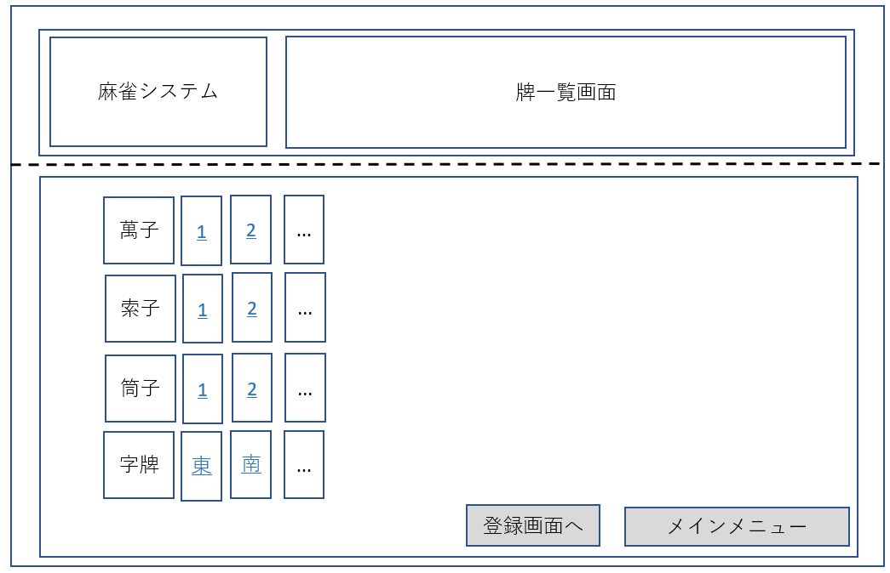
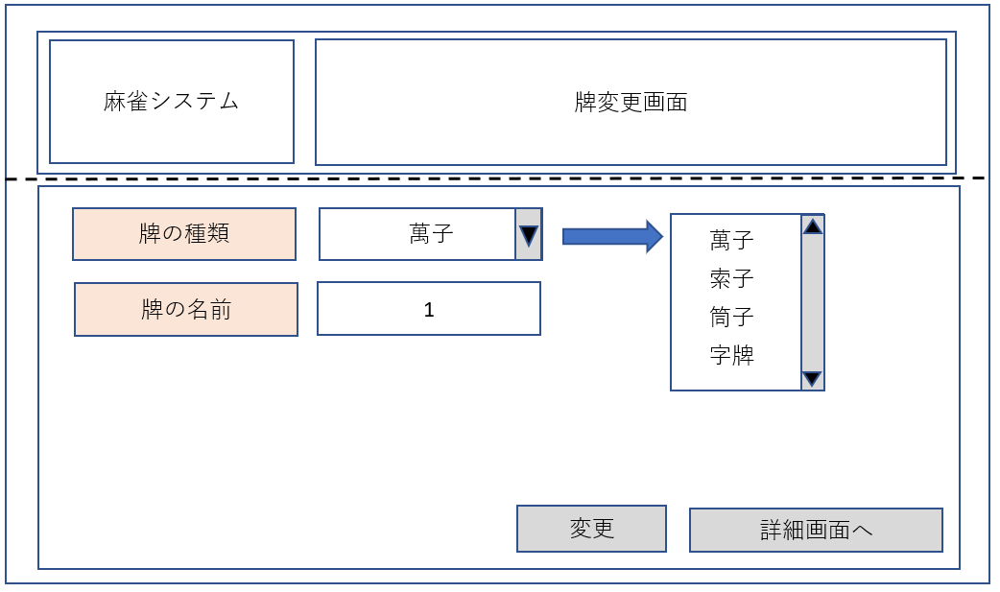

# 画面設計書
### 目的 
　麻雀システムの画面の機能について記述する。

### 変更履歴
|更新年月日|更新内容|版数|
|--|--|--|
|2019/12/04|初版発行|0|
|2019/12/25|・画面一覧を画面設計書に変更 ・画面イメージ、画面項目一覧を記述 |0.1|

### 画面一覧  

 |画面名|html名|説明|
 |--|--|--|
 |メインメニュー|MainMenu|メインメニューを表示する。|
 |牌一覧画面|PaiList|登録された牌データを一覧表示する。|
 |牌詳細画面|PaiDetail|牌データの詳細を表示する。  また、牌データを削除する。|
 |牌登録画面|PaiRegister|牌データを登録する。|
 |牌変更画面|PaiAlter|牌データを変更する。|

### 画面遷移図  

  

### 画面イメージ  

+ 全画面共通  

* メインメニュー 

* 牌一覧画面  

* 牌登録画面  

* 牌詳細画面  

* 牌変更画面  

* 牌登録画面(エラー発生時)  
※牌変更画面でエラーが発生した場合も同様のレイアウトでエラーメッセージを表示する。
.png)

### 画面項目一覧  

|画面名|項目名|項目英名|形式|I/O|必須かどうか|文字種|桁数|備考|
|--|--|--|--|--|--|--|--|--|
|全画面共通|システム名|ー|label|ー|ー|ー||システム名を表示する。"麻雀システム"固定。|
||画面名|ー|label|ー|ー|ー||現在表示している画面名を表示する。|
|メインメニュー|牌一覧|toPaiList|button|ー|ー|ー|ー|牌一覧画面を表示する。|
|牌一覧画面|牌の種類(データ欄)|paiTypesValue|text|O|ー|ー|ー|牌の種類を表示する。|
||牌の名前(データ欄)|paiNamesValue|text|O|ー|ー|ー|牌の名前を表示する。 詳細画面へのリンクとする。 拡張案⇒牌の図(牌のフォント)と牌コードを結びつけて牌の図を表示する。|
||登録画面へ|toPaiRegister|button|ー|ー|ー|ー|牌登録画面へ移動する。|
||詳細画面へ|toPaiDetail|button|ー|ー|ー|ー|牌詳細画面へ移動する。|
||メインメニュー|toMainMenu|button|ー|ー|ー|ー|メインメニューへ移動する。|
|牌登録画面|牌の種類|ー|label|ー|ー|ー|ー||
||牌の種類(入力欄)|paiTypesValue|select|I|必須|ー|ー|牌の種類をセレクトボックスより選択する。 表示値とvalue値のマッピングは以下とする。 表示値 ： value値 萬子　 ： M 索子　 ： S 筒子　 ： P 字牌　 ： J|
||牌の名前|ー|label|ー|ー|ー|ー||
||牌の名前(入力欄)|paiNamesValue|text|I|必須|半角数字・全角文字列|1|牌の名前を入力する。|
||登録|regButtun|button|ー|ー|ー|ー|入力した情報をDBへ登録する。|
|牌詳細画面|牌の種類|ー|label|ー|ー|ー|ー||
||牌の種類(データ欄)|paiTypesValue|text|O|ー|ー|ー|牌一覧画面で選択した牌の種類を表示する。(readonly)|
||牌の名前|ー|label|ー|ー|ー|ー||
||牌の名前(データ欄)|paiNamesValue|text|O|ー|ー|ー|牌一覧画面で選択した牌の名前を表示する。(readonly)|
||削除|delButton|button|ー|ー|ー|ー|牌データをDBより削除する。|
||変更|toPaiAlter|button|ー|ー|ー|ー|牌変更画面へ移動する。|
|牌変更画面|牌の種類|ー|label|ー|ー|ー|ー||
||牌の種類(データ欄)|paiTypesValue|select|I/O|必須|ー|ー|牌の種類をセレクトボックスより選択する。 表示値とvalue値のマッピングは牌登録画面と同様。 牌詳細画面のデータを初期表示する。|
||牌の名前|ー|label|ー|ー|ー|ー||
||牌の名前(データ欄)|paiNamesValue|text|I/O|必須|半角数字・全角文字列|1|牌の名前を入力する。 牌詳細画面のデータを初期表示する。|
||変更|altButton|button|ー|ー|ー|ー|変更した情報をDBへ登録する。|