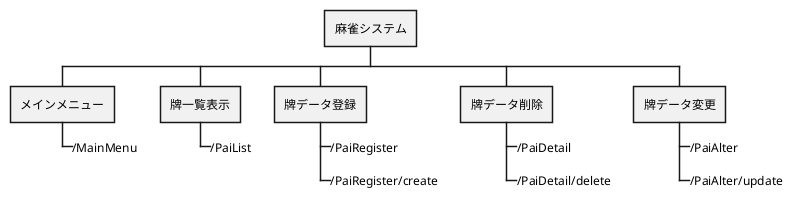

詳細設計書


目次
<!-- TOC -->

- [1. 目的](#1-目的)
- [2. 変更履歴](#2-変更履歴)
- [3. ユースケースマップ](#3-ユースケースマップ)
- [4. エンドポイント一覧](#4-エンドポイント一覧)
- [5. エンドポイント詳細](#5-エンドポイント詳細)
    - [5.1. メインメニュー画面](#51-メインメニュー画面)
        - [5.1.1. メインメニュー表示](#511-メインメニュー表示)
                - [シーケンス](#シーケンス)
                - [リクエストパラメータ](#リクエストパラメータ)
                - [レスポンスパラメータ](#レスポンスパラメータ)
                - [データマッピング](#データマッピング)
                - [特記事項](#特記事項)
    - [5.2. 牌一覧画面](#52-牌一覧画面)
        - [5.2.1. 一覧表示](#521-一覧表示)
    - [5.3. 牌登録画面](#53-牌登録画面)
        - [5.3.1. 牌データ取得](#531-牌データ取得)
        - [5.3.2. 牌データ登録](#532-牌データ登録)
    - [5.4. 牌詳細画面](#54-牌詳細画面)
        - [5.4.1. 牌データ取得](#541-牌データ取得)
        - [5.4.2. 牌データ削除](#542-牌データ削除)
    - [5.5. 牌変更画面](#55-牌変更画面)
        - [5.5.1. 牌データ取得](#551-牌データ取得)
        - [5.5.2. 牌データ変更](#552-牌データ変更)

<!-- /TOC -->

# 1. 目的
麻雀システムの機能の詳細を記述する。

# 2. 変更履歴
|更新年月日|更新内容|版数|
|--|--|--|
|2020/03/15|初版発行|0|

# 3. ユースケースマップ
本システムにおけるユースケースマップを以下に示す。




# 4. エンドポイント一覧
本システムにおけるエンドポイント一覧を以下に示す。

| 機能      | URL                 | メソッド   | レスポンス | 説明                         |
|---------|---------------------|--------|-------|----------------------------|
| メインメニュー表示 | /MainMenu           | get    | html  | メインメニューを表示する。              |
| 一覧表示    | /PaiList            | get    | json  | 牌一覧画面の初期表示。<br/>牌データを取得する。 |
|         | /PaiList/read       | get    | json  | 牌データを取得する。                 |
| 牌データ登録  | /PaiRegister        | get    | json  | 牌登録画面の表示。<br/>牌データを取得する。   |
|         | /PaiRegister/create | post   | json  | 牌データ登録処理。                  |
| 牌データ削除  | /PaiDetail          | get    | json  | 牌詳細画面の初期表示。<br/>牌データを取得する。 |
|         | /PaiDetail/delete   | delete | json  | 牌データ削除処理。                  |
| 牌データ変更  | /PaiAlter           | get    | json  | 牌変更画面初期表示。<br/>牌データを取得する。  |
|         | /PaiAlter/update    | put    | json  | 牌データ変更処理。                  |


# 5. エンドポイント詳細
本システムにおけるエンドポイント詳細を以下に示す。
## 5.1. メインメニュー画面
### 5.1.1. メインメニュー表示
##### シーケンス
```puml
actor ユーザー as User 
boundary EndPoint as EndPoint
control Service as Service
entity Repository as Repository
database DataSource as DataSource

group メインメニュー表示
  autonumber 1

    User -> EndPoint: URLアクセス
    EndPoint --> User: メインメニュー画面

end
```
##### リクエストパラメータ
- なし
##### レスポンスパラメータ
| 和名      | 英名      | 型       | 備考          |
|-----------|----------|----------|---------------|
| -      | -      |     ああああ  |  ああああ  |

##### データマッピング
- なし
##### 特記事項
- なし
## 5.2. 牌一覧画面
### 5.2.1. 一覧表示
## 5.3. 牌登録画面
### 5.3.1. 牌データ取得
### 5.3.2. 牌データ登録
## 5.4. 牌詳細画面
### 5.4.1. 牌データ取得
### 5.4.2. 牌データ削除
## 5.5. 牌変更画面
### 5.5.1. 牌データ取得
### 5.5.2. 牌データ変更
