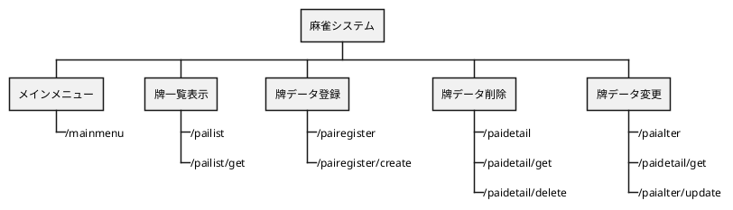

詳細設計書

目次

<!-- TOC -->

- [1. 目的](#1-目的)
- [2. 変更履歴](#2-変更履歴)
- [3. ユースケースマップ](#3-ユースケースマップ)
- [4. エンドポイント一覧](#4-エンドポイント一覧)
- [5. エンドポイント詳細](#5-エンドポイント詳細)
  - [5.1. メインメニュー画面](#51-メインメニュー画面)
    - [5.1.1. メインメニュー表示[/mainmenu]](#511-メインメニュー表示mainmenu)
      - [5.1.1.1. シーケンス](#5111-シーケンス)
      - [5.1.1.2. リクエストパラメータ](#5112-リクエストパラメータ)
      - [5.1.1.3. レスポンスパラメータ](#5113-レスポンスパラメータ)
      - [5.1.1.4. データマッピング](#5114-データマッピング)
      - [5.1.1.5. 特記事項](#5115-特記事項)
  - [5.2. 牌一覧画面](#52-牌一覧画面)
    - [5.2.1. 一覧表示[/pailist]](#521-一覧表示pailist)
      - [5.2.1.1. シーケンス](#5211-シーケンス)
      - [5.2.1.2. リクエストパラメータ](#5212-リクエストパラメータ)
      - [5.2.1.3. レスポンスパラメータ](#5213-レスポンスパラメータ)
      - [5.2.1.4. データマッピング](#5214-データマッピング)
      - [5.2.1.5. 特記事項](#5215-特記事項)
    - [5.2.2. 取得[/pailist/get]](#522-取得pailistget)
      - [5.2.2.1. シーケンス](#5221-シーケンス)
      - [5.2.2.2. リクエストパラメータ](#5222-リクエストパラメータ)
      - [5.2.2.3. レスポンスパラメータ](#5223-レスポンスパラメータ)
      - [5.2.2.4. データマッピング](#5224-データマッピング)
      - [5.2.2.5. 特記事項](#5225-特記事項)
  - [5.3. 牌登録画面](#53-牌登録画面)
    - [5.3.1. 牌登録画面表示[/pairegister]](#531-牌登録画面表示pairegister)
      - [5.3.1.1. シーケンス](#5311-シーケンス)
      - [5.3.1.2. リクエストパラメータ](#5312-リクエストパラメータ)
      - [5.3.1.3. レスポンスパラメータ](#5313-レスポンスパラメータ)
      - [5.3.1.4. データマッピング](#5314-データマッピング)
      - [5.3.1.5. 特記事項](#5315-特記事項)
    - [5.3.2. 牌データ登録[/pairegister/create]](#532-牌データ登録pairegistercreate)
      - [5.3.2.1. シーケンス](#5321-シーケンス)
      - [5.3.2.2. リクエストパラメータ](#5322-リクエストパラメータ)
      - [5.3.2.3. レスポンスパラメータ](#5323-レスポンスパラメータ)
      - [5.3.2.4. データマッピング](#5324-データマッピング)
      - [5.3.2.5. 特記事項](#5325-特記事項)
  - [5.4. 牌詳細画面](#54-牌詳細画面)
    - [5.4.1. 牌詳細画面表示[/paidetail]](#541-牌詳細画面表示paidetail)
      - [5.4.1.1. シーケンス](#5411-シーケンス)
      - [5.4.1.2. リクエストパラメータ](#5412-リクエストパラメータ)
      - [5.4.1.3. レスポンスパラメータ](#5413-レスポンスパラメータ)
      - [5.4.1.4. データマッピング](#5414-データマッピング)
      - [5.4.1.5. 特記事項](#5415-特記事項)
    - [5.4.2. 取得[/paidetail/get]](#542-取得paidetailget)
      - [5.4.2.1. シーケンス](#5421-シーケンス)
      - [5.4.2.2. リクエストパラメータ](#5422-リクエストパラメータ)
      - [5.4.2.3. レスポンスパラメータ](#5423-レスポンスパラメータ)
      - [5.4.2.4. データマッピング](#5424-データマッピング)
      - [5.4.2.5. 特記事項](#5425-特記事項)
    - [5.4.3. 牌データ削除[/paidetail/delete]](#543-牌データ削除paidetaildelete)
      - [5.4.3.1. シーケンス](#5431-シーケンス)
      - [5.4.3.2. リクエストパラメータ](#5432-リクエストパラメータ)
      - [5.4.3.3. レスポンスパラメータ](#5433-レスポンスパラメータ)
      - [5.4.3.4. データマッピング](#5434-データマッピング)
      - [5.4.3.5. 特記事項](#5435-特記事項)
  - [5.5. 牌変更画面](#55-牌変更画面)
    - [5.5.1. 牌変更画面表示[/paialter]](#551-牌変更画面表示paialter)
      - [5.5.1.1. シーケンス](#5511-シーケンス)
      - [5.5.1.2. リクエストパラメータ](#5512-リクエストパラメータ)
      - [5.5.1.3. レスポンスパラメータ](#5513-レスポンスパラメータ)
      - [5.5.1.4. データマッピング](#5514-データマッピング)
      - [5.5.1.5. 特記事項](#5515-特記事項)
    - [5.5.2. 取得[/paialter/get]](#552-取得paialterget)
      - [5.5.2.1. シーケンス](#5521-シーケンス)
      - [5.5.2.2. リクエストパラメータ](#5522-リクエストパラメータ)
      - [5.5.2.3. レスポンスパラメータ](#5523-レスポンスパラメータ)
      - [5.5.2.4. データマッピング](#5524-データマッピング)
      - [5.5.2.5. 特記事項](#5525-特記事項)
    - [5.5.3. 牌データ変更[/paialter/update]](#553-牌データ変更paialterupdate)
      - [5.5.3.1. シーケンス](#5531-シーケンス)
      - [5.5.3.2. リクエストパラメータ](#5532-リクエストパラメータ)
      - [5.5.3.3. レスポンスパラメータ](#5533-レスポンスパラメータ)
      - [5.5.3.4. データマッピング](#5534-データマッピング)
      - [5.5.3.5. 特記事項](#5535-特記事項)
  - [5.6. 画面共通事項](#56-画面共通事項)
    - [5.6.1. 入力エラーメッセージ表示](#561-入力エラーメッセージ表示)
      - [5.6.1.1. シーケンス](#5611-シーケンス)
      - [5.6.1.2. リクエストパラメータ](#5612-リクエストパラメータ)
      - [5.6.1.3. レスポンスパラメータ](#5613-レスポンスパラメータ)
      - [5.6.1.4. データマッピング](#5614-データマッピング)
      - [5.6.1.5. 特記事項](#5615-特記事項)
    - [5.6.2. DB エラーメッセージ表示](#562-db-エラーメッセージ表示)
      - [5.6.2.1. シーケンス](#5621-シーケンス)
      - [5.6.2.2. リクエストパラメータ](#5622-リクエストパラメータ)
      - [5.6.2.3. レスポンスパラメータ](#5623-レスポンスパラメータ)
      - [5.6.2.4. データマッピング](#5624-データマッピング)
      - [5.6.2.5. 特記事項](#5625-特記事項)

<!-- /TOC -->

# 1. 目的

麻雀システムの機能の詳細を記述する。

# 2. 変更履歴

| 更新年月日 | 更新内容               | 版数 |
| ---------- | ---------------------- | ---- |
| 2020/04/12 | 初版発行               | 0    |
| 2020/06/30 | エンドポイント修正     | 0.1  |
| 2020/07/09 | エンドポイント詳細修正 | 0.2  |

# 3. ユースケースマップ

本システムにおけるユースケースマップを以下に示す。



# 4. エンドポイント一覧

本システムにおけるエンドポイント一覧を以下に示す。

| 機能           | URL                 | メソッド | レスポンス | 説明                                                                  |
| -------------- | ------------------- | -------- | ---------- | --------------------------------------------------------------------- |
| メインメニュー | /mainmenu           | get      | html       | メインメニューを表示する。                                            |
| 一覧表示       | /paiList            | post     | html       | 牌一覧画面の表示。<br/>本エンドポイントではデータの取得は行わない。   |
|                | /paiList/get        | get      | json       | 牌データを全件取得する。                                              |
| 牌データ登録   | /pairegister        | post     | html       | 牌登録画面の表示。                                                    |
|                | /pairegister/create | post     | html       | 牌データ登録処理。                                                    |
| 牌データ削除   | /paidetail          | post     | html       | 牌詳細画面の表示。<br/>本エンドポイントではデータの取得は行わない。   |
|                | /paidetail/get      | get      | json       | 牌データを 1 件取得する。                                             |
|                | /paidetail/delete   | delete   | html       | 牌データ削除処理。                                                    |
| 牌データ変更   | /paialter           | post     | html       | 牌変更画面初期表示。<br/>本エンドポイントではデータの取得は行わない。 |
|                | /paiafter/get       | get      | json       | 牌データを 1 件取得する。                                             |
|                | /paialter/update    | put      | html       | 牌データ変更処理。                                                    |

# 5. エンドポイント詳細

本システムにおけるエンドポイント詳細を以下に示す。

## 5.1. メインメニュー画面

### 5.1.1. メインメニュー表示[/mainmenu]

#### 5.1.1.1. シーケンス

```puml
actor ユーザー as User
boundary Endpoint as Con
control Service as Ser
entity Repository as Repo
database DB as DB

group メインメニュー表示
  autonumber 1

    User -> Con: URLアクセス
    Con --> User: メインメニュー画面

end
```

#### 5.1.1.2. リクエストパラメータ

- なし

#### 5.1.1.3. レスポンスパラメータ

| 和名 | 英名 | 型     | 備考            |
| ---- | ---- | ------ | --------------- |
| -    | -    | String | "mainmenu" 固定 |

#### 5.1.1.4. データマッピング

- なし

#### 5.1.1.5. 特記事項

- なし

## 5.2. 牌一覧画面

### 5.2.1. 一覧表示[/pailist]

#### 5.2.1.1. シーケンス

```puml
actor ユーザー as User
boundary Endpoint as Con
control Service as Ser
entity Repository as Repo
database DB as DB

group 一覧表示
  autonumber 1
    User -> Con: 「牌一覧」ボタン押下
    Con --> User: 牌一覧画面表示
end
```

#### 5.2.1.2. リクエストパラメータ

- なし

#### 5.2.1.3. レスポンスパラメータ

| 和名 | 英名 | 型     | 備考           |
| ---- | ---- | ------ | -------------- |
| -    | -    | String | "pailist" 固定 |

#### 5.2.1.4. データマッピング

- なし

#### 5.2.1.5. 特記事項

- なし

### 5.2.2. 取得[/pailist/get]

#### 5.2.2.1. シーケンス

```puml
actor ユーザー as User
boundary Endpoint as Con
control Service as Ser
entity Repository as Repo
database DB as DB

group データ取得
  autonumber 1
    User -> Con: データ取得処理
    Con -> Ser: 処理要求
    Ser -> Repo: 処理要求
    Repo -> DB: SQL発行
    DB -> Repo: SQL実行結果返却
    Repo -> Ser: 結果返却
    Ser -> Con: 結果返却
    Con -> User: JSONデータ
end
```

#### 5.2.2.2. リクエストパラメータ

- なし

#### 5.2.2.3. レスポンスパラメータ

- 牌データを全件取得する。

| 和名     | 英名          | 型     | 備考 |
| -------- | ------------- | ------ | ---- |
| 牌の種類 | paiTypesValue | String | -    |
| 牌の名前 | paiNamesValue | String | -    |

- 返却値の例

```json
[
  {
    "paiTypesValue": "S"
    "paiNamesValue": "1"
  },{...}
]
```

#### 5.2.2.4. データマッピング

- 牌データ全件取得

```sql
select
  牌情報テーブル.牌の種類
  牌情報テーブル.牌の名前
from
  牌情報テーブル
```

#### 5.2.2.5. 特記事項

- なし

## 5.3. 牌登録画面

### 5.3.1. 牌登録画面表示[/pairegister]

#### 5.3.1.1. シーケンス

```puml
scale 0.8
actor ユーザー as User
boundary Endpoint as Con
control Service as Ser
entity Repository as Repo
database DB as DB

group 牌データ登録
  autonumber 1

    User -> Con: 「登録画面へ」ボタン押下
    Con -> User: 登録画面表示

end
```

#### 5.3.1.2. リクエストパラメータ

- なし

#### 5.3.1.3. レスポンスパラメータ

| 和名 | 英名 | 型     | 備考               |
| ---- | ---- | ------ | ------------------ |
| -    | -    | String | "pairegister" 固定 |

#### 5.3.1.4. データマッピング

- なし

#### 5.3.1.5. 特記事項

- なし

### 5.3.2. 牌データ登録[/pairegister/create]

#### 5.3.2.1. シーケンス

```puml
scale 0.8
actor ユーザー as User
boundary Endpoint as Con
control Service as Ser
entity Repository as Repo
database DB as DB

group 牌データ登録
  autonumber 1

    User -> User: 情報入力
    User -> Con: 「登録」ボタン押下
    Con -> Con: 入力チェック
    Con -> Ser: 処理要求
    Ser -> Repo: 処理要求
    Repo -> DB: SQL発行
    DB -> Repo: SQL実行結果返却
    Repo -> Ser: 結果返却
    Ser -> Con: 結果返却
    Con --> User: 牌一覧画面表示


end
```

#### 5.3.2.2. リクエストパラメータ

| 和名     | 英名          | 型     | 備考 |
| -------- | ------------- | ------ | ---- |
| 牌の種類 | paiTypesValue | String | -    |
| 牌の名前 | paiNamesValue | String | -    |

#### 5.3.2.3. レスポンスパラメータ

- 登録成功時

| 和名 | 英名 | 型     | 備考           |
| ---- | ---- | ------ | -------------- |
| -    | -    | String | "pailist" 固定 |

- 登録失敗時

| 和名 | 英名 | 型     | 備考               |
| ---- | ---- | ------ | ------------------ |
| -    | -    | String | "pairegister" 固定 |

#### 5.3.2.4. データマッピング

- 牌データ登録

```sql
insert into 牌情報テーブル('牌ID','牌の種類','牌の名前')
values('牌の種類+牌の名前','牌の種類','牌の名前')
```

#### 5.3.2.5. 特記事項

- 入力ルール
  - 牌の種類はセレクトボックスより選択する。
  - 牌の名前は萬子、索子、筒子の場合 →1 ～ 9、字牌の場合 → 東南西北白發中
- 牌 ID は入力された牌の種類+牌の名前を結合する。
- 必須入力欄を入力せずに登録ボタンを押した場合、エラーメッセージを表示する。
- キー制約違反などが起きた場合、エラーメッセージを表示する。

## 5.4. 牌詳細画面

### 5.4.1. 牌詳細画面表示[/paidetail]

#### 5.4.1.1. シーケンス

```puml
scale 0.8
actor ユーザー as User
boundary Endpoint as Con
control Service as Ser
entity Repository as Repo
database DB as DB

group 牌詳細画面表示
  autonumber 1

    User -> Con: 「詳細」ボタン押下
    Con -> User: 牌詳細画面表示

end
```

#### 5.4.1.2. リクエストパラメータ

- なし

#### 5.4.1.3. レスポンスパラメータ

| 和名 | 英名 | 型     | 備考             |
| ---- | ---- | ------ | ---------------- |
| -    | -    | String | "paidetail" 固定 |

#### 5.4.1.4. データマッピング

- なし

#### 5.4.1.5. 特記事項

- なし

### 5.4.2. 取得[/paidetail/get]

#### 5.4.2.1. シーケンス

```puml
actor ユーザー as User
boundary Endpoint as Con
control Service as Ser
entity Repository as Repo
database DB as DB

group データ取得
  autonumber 1
    User -> Con: データ取得処理
    Con -> Ser: 処理要求
    Ser -> Repo: 処理要求
    Repo -> DB: SQL発行
    DB -> Repo: SQL実行結果返却
    Repo -> Ser: 結果返却
    Ser -> Con: 結果返却
    Con -> User: JSONデータ
end
```

#### 5.4.2.2. リクエストパラメータ

- なし

#### 5.4.2.3. レスポンスパラメータ

| 和名     | 英名          | 型     | 備考 |
| -------- | ------------- | ------ | ---- |
| 牌の種類 | paiTypesValue | String | -    |
| 牌の名前 | paiNamesValue | String | -    |

- 返却値の例(索子の 1 の場合)

```json
{
  "paiTypesValue": "S"
  "paiNamesValue": "1"
}
```

#### 5.4.2.4. データマッピング

- 牌データ 1 件取得

```sql
select
  牌情報テーブル.牌の種類
  牌情報テーブル.牌の名前
from
  牌情報テーブル
where
  牌情報テーブル.牌ID = 牌の種類+牌の名前(※1)
```

#### 5.4.2.5. 特記事項

※1 画面より入力された牌の種類と牌の名前を結合する

### 5.4.3. 牌データ削除[/paidetail/delete]

#### 5.4.3.1. シーケンス

```puml
scale 0.8
actor ユーザー as User
boundary Endpoint as Con
control Service as Ser
entity Repository as Repo
database DB as DB

group 牌データ削除
  autonumber 1

    User -> Con: 「削除」ボタン押下
    Con -> Ser: 処理要求
    Ser -> Repo: 処理要求
    Repo -> DB: SQL発行
    DB -> Repo: SQL結果
    Repo -> Ser: 結果返却
    Ser -> Con: 結果返却
    Con -> User: 牌一覧画面表示

end
```

#### 5.4.3.2. リクエストパラメータ

| 和名     | 英名          | 型     | 備考 |
| -------- | ------------- | ------ | ---- |
| 牌の種類 | paiTypesValue | String | -    |
| 牌の名前 | paiNamesValue | String | -    |

#### 5.4.3.3. レスポンスパラメータ

| 和名 | 英名 | 型     | 備考           |
| ---- | ---- | ------ | -------------- |
| -    | -    | String | "pailist" 固定 |

#### 5.4.3.4. データマッピング

```sql
delete from
  牌情報テーブル
where
  牌情報テーブル.牌ID = 牌の種類+牌の名前(※1)
```

#### 5.4.3.5. 特記事項

※1 画面より入力された牌の種類と牌の名前を結合する

## 5.5. 牌変更画面

### 5.5.1. 牌変更画面表示[/paialter]

#### 5.5.1.1. シーケンス

```puml
scale 0.8
actor ユーザー as User
boundary Endpoint as Con
control Service as Ser
entity Repository as Repo
database DB as DB

group 牌変更画面表示
  autonumber 1

    User -> Con: 「変更画面へ」ボタン押下
    Con -> User: 牌変更画面表示

end
```

#### 5.5.1.2. リクエストパラメータ

- なし

#### 5.5.1.3. レスポンスパラメータ

| 和名 | 英名 | 型     | 備考           |
| ---- | ---- | ------ | -------------- |
| -    | -    | String | "pailist" 固定 |

#### 5.5.1.4. データマッピング

- なし

#### 5.5.1.5. 特記事項

- なし

### 5.5.2. 取得[/paialter/get]

#### 5.5.2.1. シーケンス

```puml
actor ユーザー as User
boundary Endpoint as Con
control Service as Ser
entity Repository as Repo
database DB as DB

group データ取得
  autonumber 1
    User -> Con: データ取得処理
    Con -> Ser: 処理要求
    Ser -> Repo: 処理要求
    Repo -> DB: SQL発行
    DB -> Repo: SQL実行結果返却
    Repo -> Ser: 結果返却
    Ser -> Con: 結果返却
    Con -> User: JSONデータ
end
```

#### 5.5.2.2. リクエストパラメータ

- なし

#### 5.5.2.3. レスポンスパラメータ

| 和名     | 英名          | 型     | 備考 |
| -------- | ------------- | ------ | ---- |
| 牌の種類 | paiTypesValue | String | -    |
| 牌の名前 | paiNamesValue | String | -    |

- 返却値の例(索子の 1 の場合)

```json
{
  "paiTypesValue": "S"
  "paiNamesValue": "1"
}
```

#### 5.5.2.4. データマッピング

- 牌データ 1 件取得

```sql
select
  牌情報テーブル.牌の種類
  牌情報テーブル.牌の名前
from
  牌情報テーブル
where
  牌情報テーブル.牌ID = 牌の種類+牌の名前(※1)
```

#### 5.5.2.5. 特記事項

※1 画面より入力された牌の種類と牌の名前を結合する

### 5.5.3. 牌データ変更[/paialter/update]

#### 5.5.3.1. シーケンス

```puml
scale 0.8
actor ユーザー as User
boundary Endpoint as Con
control Service as Ser
entity Repository as Repo
database DB as DB

group 牌データ変更
  autonumber 1

    User -> User: 情報入力
    User -> Con: 「登録」ボタン押下
    Con -> Con: 入力チェック

    Con -> Ser: 処理要求
    Ser -> Repo: 処理要求
    Repo -> DB: SQL発行
    DB -> Repo: SQL実行結果返却
    Repo -> Ser: 結果返却
    Ser -> Con: 結果返却
    Con --> User: 牌詳細画面表示

end
```

#### 5.5.3.2. リクエストパラメータ

| 和名     | 英名          | 型     | 備考 |
| -------- | ------------- | ------ | ---- |
| 牌の種類 | paiTypesValue | String | -    |
| 牌の名前 | paiNamesValue | String | -    |

#### 5.5.3.3. レスポンスパラメータ

- 登録成功時

| 和名 | 英名 | 型     | 備考             |
| ---- | ---- | ------ | ---------------- |
| -    | -    | String | "paidetail" 固定 |

- 登録失敗時

| 和名 | 英名 | 型     | 備考            |
| ---- | ---- | ------ | --------------- |
| -    | -    | String | "paialter" 固定 |

#### 5.5.3.4. データマッピング

- 牌データ変更

```sql
update  牌情報テーブル
set  牌情報テーブル.牌ID = 牌の種類+牌の名前
     牌情報テーブル.牌の種類 = 牌の種類
     牌情報テーブル.牌の名前 = 牌の名前
where 牌情報テーブル.牌ID = 変更前の牌ID

```

#### 5.5.3.5. 特記事項

- 入力ルール
  - 牌の種類はセレクトボックスより選択する。
  - 牌の名前は萬子、索子、筒子の場合 →1 ～ 9、字牌の場合 → 東南西北白發中
- 牌 ID は入力された牌の種類+牌の名前を結合する。
- 必須入力欄を入力せずに登録ボタンを押した場合、エラーメッセージを表示する。
- キー制約違反などが起きた場合、エラーメッセージを表示する。

## 5.6. 画面共通事項

### 5.6.1. 入力エラーメッセージ表示

#### 5.6.1.1. シーケンス

```puml
scale 0.8
actor ユーザー as User
boundary Endpoint as Con
control Service as Ser
entity Repository as Repo
database DB as DB

group 画面遷移失敗
  autonumber 1

    User -> User: 情報入力
    User -> Con: ボタン押下
    Con -> Con: 入力チェック
    Con -> User: エラーメッセージ

end
```

#### 5.6.1.2. リクエストパラメータ

#### 5.6.1.3. レスポンスパラメータ

#### 5.6.1.4. データマッピング

#### 5.6.1.5. 特記事項

- エラーメッセージを表示し、画面遷移は行わない

### 5.6.2. DB エラーメッセージ表示

#### 5.6.2.1. シーケンス

```puml
scale 0.8
actor ユーザー as User
boundary Endpoint as Con
control Service as Ser
entity Repository as Repo
database DB as DB

group 登録失敗
  autonumber 1

    User -> User: 情報入力
    User -> Con: ボタン押下
    Con -> Ser: 処理要求
    Ser -> Repo: 処理要求
    Repo -> DB: SQL発行
    DB -> Repo: SQL実行結果
    Repo -> Ser: 失敗返却
    Ser -> Con: 失敗返却
    Con -> User: エラーメッセージ

end
```

#### 5.6.2.2. リクエストパラメータ

#### 5.6.2.3. レスポンスパラメータ

#### 5.6.2.4. データマッピング

#### 5.6.2.5. 特記事項

- エラーメッセージを表示し、画面遷移は行わない
