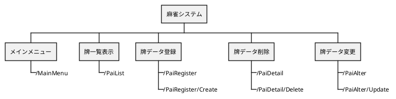

詳細設計書

目次

<!-- TOC -->

- [1. 目的](#1-目的)
- [2. 変更履歴](#2-変更履歴)
- [3. ユースケースマップ](#3-ユースケースマップ)
- [4. エンドポイント一覧](#4-エンドポイント一覧)
- [5. エンドポイント詳細](#5-エンドポイント詳細)
  - [5.1. メインメニュー画面](#51-メインメニュー画面)
    - [5.1.1. メインメニュー表示[/MainMenu]](#511-メインメニュー表示mainmenu)
      - [5.1.1.1. シーケンス](#5111-シーケンス)
      - [5.1.1.2. リクエストパラメータ](#5112-リクエストパラメータ)
      - [5.1.1.3. レスポンスパラメータ](#5113-レスポンスパラメータ)
      - [5.1.1.4. データマッピング](#5114-データマッピング)
      - [5.1.1.5. 特記事項](#5115-特記事項)
  - [5.2. 牌一覧画面](#52-牌一覧画面)
    - [5.2.1. 一覧表示[/PaiList]](#521-一覧表示pailist)
      - [5.2.1.1. シーケンス](#5211-シーケンス)
      - [5.2.1.2. リクエストパラメータ](#5212-リクエストパラメータ)
      - [5.2.1.3. レスポンスパラメータ](#5213-レスポンスパラメータ)
      - [5.2.1.4. データマッピング](#5214-データマッピング)
      - [5.2.1.5. 特記事項](#5215-特記事項)
  - [5.3. 牌登録画面](#53-牌登録画面)
    - [5.3.1. 牌登録画面表示[/PaiRegister]](#531-牌登録画面表示pairegister)
      - [5.3.1.1. シーケンス](#5311-シーケンス)
      - [5.3.1.2. リクエストパラメータ](#5312-リクエストパラメータ)
      - [5.3.1.3. レスポンスパラメータ](#5313-レスポンスパラメータ)
      - [5.3.1.4. データマッピング](#5314-データマッピング)
      - [5.3.1.5. 特記事項](#5315-特記事項)
    - [5.3.2. 牌データ登録[/PaiRegister/Create]](#532-牌データ登録pairegistercreate)
      - [5.3.2.1. シーケンス](#5321-シーケンス)
      - [5.3.2.2. リクエストパラメータ](#5322-リクエストパラメータ)
      - [5.3.2.3. レスポンスパラメータ](#5323-レスポンスパラメータ)
      - [5.3.2.4. データマッピング](#5324-データマッピング)
      - [5.3.2.5. 特記事項](#5325-特記事項)
  - [5.4. 牌詳細画面](#54-牌詳細画面)
    - [5.4.1. 牌詳細画面表示[/PaiDetail]](#541-牌詳細画面表示paidetail)
      - [5.4.1.1. シーケンス](#5411-シーケンス)
      - [5.4.1.2. リクエストパラメータ](#5412-リクエストパラメータ)
      - [5.4.1.3. レスポンスパラメータ](#5413-レスポンスパラメータ)
      - [5.4.1.4. データマッピング](#5414-データマッピング)
      - [5.4.1.5. 特記事項](#5415-特記事項)
    - [5.4.2. 牌データ削除[/PaiDetail/Delete]](#542-牌データ削除paidetaildelete)
      - [5.4.2.1. シーケンス](#5421-シーケンス)
      - [5.4.2.2. リクエストパラメータ](#5422-リクエストパラメータ)
      - [5.4.2.3. レスポンスパラメータ](#5423-レスポンスパラメータ)
      - [5.4.2.4. データマッピング](#5424-データマッピング)
      - [5.4.2.5. 特記事項](#5425-特記事項)
  - [5.5. 牌変更画面](#55-牌変更画面)
    - [5.5.1. 牌変更画面表示[/PaiAlter]](#551-牌変更画面表示paialter)
      - [5.5.1.1. シーケンス](#5511-シーケンス)
      - [5.5.1.2. リクエストパラメータ](#5512-リクエストパラメータ)
      - [5.5.1.3. レスポンスパラメータ](#5513-レスポンスパラメータ)
      - [5.5.1.4. データマッピング](#5514-データマッピング)
      - [5.5.1.5. 特記事項](#5515-特記事項)
    - [5.5.2. 牌データ変更[/PaiAlter/Update]](#552-牌データ変更paialterupdate)
      - [5.5.2.1. シーケンス](#5521-シーケンス)
      - [5.5.2.2. リクエストパラメータ](#5522-リクエストパラメータ)
      - [5.5.2.3. レスポンスパラメータ](#5523-レスポンスパラメータ)
      - [5.5.2.4. データマッピング](#5524-データマッピング)
      - [5.5.2.5. 特記事項](#5525-特記事項)

<!-- /TOC -->

# 1. 目的

麻雀システムの機能の詳細を記述する。

# 2. 変更履歴

| 更新年月日 | 更新内容 | 版数 |
| ---------- | -------- | ---- |
| 2020/04/12 | 初版発行 | 0    |

# 3. ユースケースマップ

本システムにおけるユースケースマップを以下に示す。



# 4. エンドポイント一覧

本システムにおけるエンドポイント一覧を以下に示す。

| 機能           | URL                 | メソッド | レスポンス | 説明                                            |
| -------------- | ------------------- | -------- | ---------- | ----------------------------------------------- |
| メインメニュー | /MainMenu           | get      | html       | メインメニューを表示する。                      |
| 一覧表示       | /PaiList            | get      | html       | 牌一覧画面の初期表示。<br/>牌データを取得する。 |
| 牌データ登録   | /PaiRegister        | get      | html       | 牌登録画面の表示。                              |
|                | /PaiRegister/Create | post     | json       | 牌データ登録処理。                              |
| 牌データ削除   | /PaiDetail          | get      | html       | 牌詳細画面の初期表示。<br/>牌データを取得する。 |
|                | /PaiDetail/Delete   | delete   | json       | 牌データ削除処理。                              |
| 牌データ変更   | /PaiAlter           | get      | html       | 牌変更画面初期表示。<br/>牌データを取得する。   |
|                | /PaiAlter/Update    | put      | json       | 牌データ変更処理。                              |

# 5. エンドポイント詳細

本システムにおけるエンドポイント詳細を以下に示す。

## 5.1. メインメニュー画面

### 5.1.1. メインメニュー表示[/MainMenu]

#### 5.1.1.1. シーケンス

```puml
actor ユーザー as User
boundary Endpoint as Con
control Service as Ser
entity Repository as Repo
database DB as DB

group メインメニュー表示
  autonumber 1

    User -> Con: URLアクセス
    Con --> User: メインメニュー画面

end
```

#### 5.1.1.2. リクエストパラメータ

- なし

#### 5.1.1.3. レスポンスパラメータ

| 和名 | 英名 | 型     | 備考            |
| ---- | ---- | ------ | --------------- |
| -    | -    | String | "MainMenu" 固定 |

#### 5.1.1.4. データマッピング

- なし

#### 5.1.1.5. 特記事項

- なし

## 5.2. 牌一覧画面

### 5.2.1. 一覧表示[/PaiList]

#### 5.2.1.1. シーケンス

```puml
actor ユーザー as User
boundary Endpoint as Con
control Service as Ser
entity Repository as Repo
database DB as DB

group 一覧表示
  autonumber 1

    User -> Con: 「牌一覧」ボタン押下
    Con -> Ser: 処理要求
    Ser -> Repo: 処理要求
    Repo -> DB: SQL発行
    DB -> Repo: SQL実行結果返却
    Repo -> Ser: 結果返却
    Ser -> Con: 結果返却
    Con --> User: 牌一覧画面表示

end
```

#### 5.2.1.2. リクエストパラメータ

- なし

#### 5.2.1.3. レスポンスパラメータ

| 和名     | 英名          | 型     | 備考           |
| -------- | ------------- | ------ | -------------- |
| -        | -             | String | "PaiList" 固定 |
| 牌の種類 | paiTypesValue | String | -              |
| 牌の名前 | paiNamesValue | String | -              |

- 返却値の例(索子の 1 の場合)

```json
{
  "paiTypesValue": "S"
  "paiNamesValue": "1"
}
```

#### 5.2.1.4. データマッピング

- 牌データ全件取得

```sql
select
  牌情報テーブル.牌の種類
  牌情報テーブル.牌の名前
from
  牌情報テーブル
```

#### 5.2.1.5. 特記事項

- なし

## 5.3. 牌登録画面

### 5.3.1. 牌登録画面表示[/PaiRegister]

#### 5.3.1.1. シーケンス

```puml
scale 0.8
actor ユーザー as User
boundary Endpoint as Con
control Service as Ser
entity Repository as Repo
database DB as DB

group 牌データ登録
  autonumber 1

    User -> Con: 「登録画面へ」ボタン押下
    Con -> User: 登録画面表示

end
```

#### 5.3.1.2. リクエストパラメータ

- なし

#### 5.3.1.3. レスポンスパラメータ

| 和名 | 英名 | 型     | 備考               |
| ---- | ---- | ------ | ------------------ |
| -    | -    | String | "PaiRegister" 固定 |

#### 5.3.1.4. データマッピング

- なし

#### 5.3.1.5. 特記事項

- なし

### 5.3.2. 牌データ登録[/PaiRegister/Create]

#### 5.3.2.1. シーケンス

```puml
scale 0.8
actor ユーザー as User
boundary Endpoint as Con
control Service as Ser
entity Repository as Repo
database DB as DB

group 牌データ登録
  autonumber 1

    User -> User: 情報入力
    User -> Con: 「登録」ボタン押下
    group 登録成功
    autonumber 4
    Con -> Ser: 処理要求
    Ser -> Repo: 処理要求
    Repo -> DB: SQL発行
    DB -> Repo: SQL実行結果返却
    Repo -> Ser: 結果返却
    Ser -> Con: 結果返却
    Con --> User: 牌一覧画面表示
    end
    group 登録失敗(入力必須文字がない等)
    autonumber 4
    Con -> Con: 要求失敗
    Con -> User: エラーメッセージ表示
    end
    group 登録失敗(キー制約違反等)
    autonumber 4
    Con -> Ser: 処理要求
    Ser -> Repo: 処理要求
    Repo -> DB: SQL発行
    DB -> Repo: 登録失敗
    Repo -> Ser: 結果返却
    Ser -> Con: 結果返却
    Con --> User: エラーメッセージ表示
    end

end
```

#### 5.3.2.2. リクエストパラメータ

| 和名     | 英名          | 型     | 備考 |
| -------- | ------------- | ------ | ---- |
| 牌の種類 | paiTypesValue | String | -    |
| 牌の名前 | paiNamesValue | String | -    |

#### 5.3.2.3. レスポンスパラメータ

- 登録成功時

| 和名 | 英名 | 型     | 備考            |
| ---- | ---- | ------ | --------------- |
| -    | -    | String | "MainMenu" 固定 |

- 登録失敗時

| 和名 | 英名 | 型     | 備考               |
| ---- | ---- | ------ | ------------------ |
| -    | -    | String | "PaiRegister" 固定 |

#### 5.3.2.4. データマッピング

- 牌データ登録

```sql
insert into 牌情報テーブル('牌ID','牌の種類','牌の名前')
values('牌の種類+牌の名前','牌の種類','牌の名前')
```

#### 5.3.2.5. 特記事項

- 入力ルール
  - 牌の種類はセレクトボックスより選択する。
  - 牌の名前は萬子、索子、筒子の場合 →1 ～ 9、字牌の場合 → 東南西北白發中
- 牌 ID は入力された牌の種類+牌の名前を結合する。
- 必須入力欄を入力せずに登録ボタンを押した場合、エラーメッセージを表示する。
- キー制約違反などが起きた場合、エラーメッセージを表示する。

## 5.4. 牌詳細画面

### 5.4.1. 牌詳細画面表示[/PaiDetail]

#### 5.4.1.1. シーケンス

```puml
scale 0.8
actor ユーザー as User
boundary Endpoint as Con
control Service as Ser
entity Repository as Repo
database DB as DB

group 牌詳細画面表示
  autonumber 1

    User -> Con: 「詳細」ボタン押下
    Con -> Ser: 処理要求
    Ser -> Repo: 処理要求
    Repo -> DB: SQL発行
    DB -> Repo: SQL結果返却
    Repo -> Ser: 結果返却
    Ser -> Con: 結果返却
    Con -> User: 牌詳細画面表示

end
```

#### 5.4.1.2. リクエストパラメータ

| 和名     | 英名          | 型     | 備考 |
| -------- | ------------- | ------ | ---- |
| 牌の種類 | paiTypesValue | String | -    |
| 牌の名前 | paiNamesValue | String | -    |

#### 5.4.1.3. レスポンスパラメータ

| 和名     | 英名          | 型     | 備考             |
| -------- | ------------- | ------ | ---------------- |
| -        | -             | String | "PaiDetail" 固定 |
| 牌の種類 | paiTypesValue | String | -                |
| 牌の名前 | paiNamesValue | String | -                |

- 返却値の例(索子の 1 の場合)

```json
{
  "paiTypesValue": "S"
  "paiNamesValue": "1"
}
```

#### 5.4.1.4. データマッピング

```sql
select
  牌情報テーブル.牌の種類
  牌情報テーブル.牌の名前
from
  牌情報テーブル
where
  牌情報テーブル.牌ID = 牌の種類+牌の名前(※1)
```

#### 5.4.1.5. 特記事項

※1 画面より入力された牌の種類と牌の名前を結合する

### 5.4.2. 牌データ削除[/PaiDetail/Delete]

#### 5.4.2.1. シーケンス

```puml
scale 0.8
actor ユーザー as User
boundary Endpoint as Con
control Service as Ser
entity Repository as Repo
database DB as DB

group 牌データ削除
  autonumber 1

    User -> Con: 「削除」ボタン押下
    Con -> Ser: 処理要求
    Ser -> Repo: 処理要求
    Repo -> DB: SQL発行
    DB -> Repo: SQL結果返却
    Repo -> Ser: 結果返却
    Ser -> Con: 結果返却
    Con -> User: 牌一覧画面表示

end
```

#### 5.4.2.2. リクエストパラメータ

| 和名     | 英名          | 型     | 備考 |
| -------- | ------------- | ------ | ---- |
| 牌の種類 | paiTypesValue | String | -    |
| 牌の名前 | paiNamesValue | String | -    |

#### 5.4.2.3. レスポンスパラメータ

| 和名 | 英名 | 型     | 備考           |
| ---- | ---- | ------ | -------------- |
| -    | -    | String | "PaiList" 固定 |

#### 5.4.2.4. データマッピング

```sql
delete from
  牌情報テーブル
where
  牌情報テーブル.牌ID = 牌の種類+牌の名前(※1)
```

#### 5.4.2.5. 特記事項

※1 画面より入力された牌の種類と牌の名前を結合する

## 5.5. 牌変更画面

### 5.5.1. 牌変更画面表示[/PaiAlter]

#### 5.5.1.1. シーケンス

```puml
scale 0.8
actor ユーザー as User
boundary Endpoint as Con
control Service as Ser
entity Repository as Repo
database DB as DB

group 牌変更画面表示
  autonumber 1

    User -> Con: 「変更画面へ」ボタン押下
    Con -> Ser: 処理要求
    Ser -> Repo: 処理要求
    Repo -> DB: SQL発行
    DB -> Repo: SQL結果返却
    Repo -> Ser: 結果返却
    Ser -> Con: 結果返却
    Con -> User: 牌一覧画面表示

end
```

#### 5.5.1.2. リクエストパラメータ

| 和名     | 英名          | 型     | 備考 |
| -------- | ------------- | ------ | ---- |
| 牌の種類 | paiTypesValue | String | -    |
| 牌の名前 | paiNamesValue | String | -    |

#### 5.5.1.3. レスポンスパラメータ

| 和名 | 英名 | 型     | 備考           |
| ---- | ---- | ------ | -------------- |
| -    | -    | String | "PaiList" 固定 |

#### 5.5.1.4. データマッピング

```sql
delete from
  牌情報テーブル
where
  牌情報テーブル.牌ID = 牌の種類+牌の名前(※1)
```

#### 5.5.1.5. 特記事項

※1 画面より入力された牌の種類と牌の名前を結合する

### 5.5.2. 牌データ変更[/PaiAlter/Update]

#### 5.5.2.1. シーケンス

```puml
scale 0.8
actor ユーザー as User
boundary Endpoint as Con
control Service as Ser
entity Repository as Repo
database DB as DB

group 牌データ変更
  autonumber 1

    User -> User: 情報入力
    User -> Con: 「登録」ボタン押下
    group 登録成功
    autonumber 4
    Con -> Ser: 処理要求
    Ser -> Repo: 処理要求
    Repo -> DB: SQL発行
    DB -> Repo: SQL実行結果返却
    Repo -> Ser: 結果返却
    Ser -> Con: 結果返却
    Con --> User: 牌一覧画面表示
    end
    group 登録失敗(入力必須文字がない等)
    autonumber 4
    Con -> Con: 要求失敗
    Con -> User: エラーメッセージ表示
    end
    group 登録失敗(キー制約違反等)
    autonumber 4
    Con -> Ser: 処理要求
    Ser -> Repo: 処理要求
    Repo -> DB: SQL発行
    DB -> Repo: 登録失敗
    Repo -> Ser: 結果返却
    Ser -> Con: 結果返却
    Con --> User: エラーメッセージ表示
    end

end
```

#### 5.5.2.2. リクエストパラメータ

| 和名     | 英名          | 型     | 備考 |
| -------- | ------------- | ------ | ---- |
| 牌の種類 | paiTypesValue | String | -    |
| 牌の名前 | paiNamesValue | String | -    |

#### 5.5.2.3. レスポンスパラメータ

- 登録成功時

| 和名 | 英名 | 型     | 備考             |
| ---- | ---- | ------ | ---------------- |
| -    | -    | String | "PaiDetail" 固定 |

- 登録失敗時

| 和名 | 英名 | 型     | 備考            |
| ---- | ---- | ------ | --------------- |
| -    | -    | String | "PaiAlter" 固定 |

#### 5.5.2.4. データマッピング

- 牌データ変更

```sql
update  牌情報テーブル
set  牌情報テーブル.牌ID = 牌の種類+牌の名前
     牌情報テーブル.牌の種類 = 牌の種類
     牌情報テーブル.牌の名前 = 牌の名前
where 牌情報テーブル.牌ID = 変更前の牌ID

```

#### 5.5.2.5. 特記事項

- 入力ルール
  - 牌の種類はセレクトボックスより選択する。
  - 牌の名前は萬子、索子、筒子の場合 →1 ～ 9、字牌の場合 → 東南西北白發中
- 牌 ID は入力された牌の種類+牌の名前を結合する。
- 必須入力欄を入力せずに登録ボタンを押した場合、エラーメッセージを表示する。
- キー制約違反などが起きた場合、エラーメッセージを表示する。
